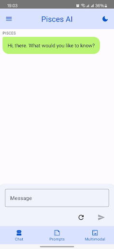
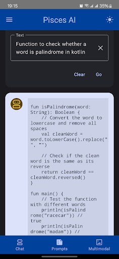
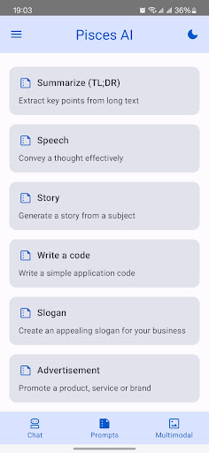

# Pisces AI - Your Ocean of Possibilities

Powered by Google's state-of-the-art generative AI model; the Gemini

## Screenshots

## Features

This sample showcases the following API capability:
* Generate Text - Math tutor, Create a simple web page...
* Image Reasoning - Object identifier, Recipe creator...
* Chat - AI assistant, Brainstorm...

## Google Play Store

You can download from [here](https://play.google.com/store/apps/details?id=com.nilearning.ai.pisces).
